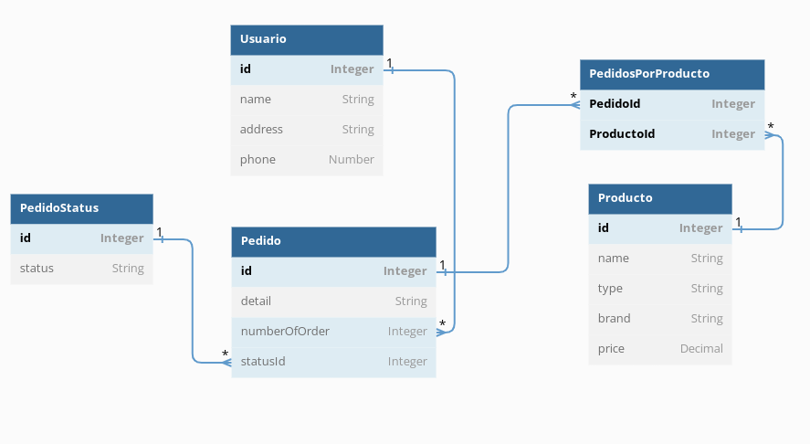

#### Resolute Solutions

### Challenge 

## Task 1
​
- Database Design and Optimization Challenge: Design a database schema for a simple eCommerce system including tables like User, Product, and Order. How would you optimize this schema for efficiency and scalability? What types of indexes would you implement and why?

## Solution

- Inicialmente debo tener encuenta, que el nicho de mercado de mi Ecommerce, sería la venta de productos y que debo garantizar la integridad de los datos($) en función del tiempo, por esta razón me inclino por una base de datos de tipo SQL.

# How would you optimize this schema for efficiency and scalability?

- Para mejorar la eficiencia y escalabilidad me baso en las reglas de Normalización como:
la primera forma normal , segunda forma normal, tercera forma normal, donde los datos no deberian estar repetidos, evitar redundacia de los datos y mantener la integridad y datos con una unica identidad(id).

# What types of indexes would you implement and why?

- Para este caso utilizaria, indice de árbol B+: porque me permitiría hacer consultas individuales y rapidas acorde al tipo de los datos que he almacenado, donde me puedo traer los pedidos que tengan un status de devolución en un rago determinado de tiempo, donde si se encuentran en el rango se procedería a la devolución del dinero según la norma del consumidor. 

# Database Design

1. Como primer paso, indentifico las entidades de mi sistema de comercio y asignó sus atributos en relación a cada enfoque como se ve en el diagrama:

- Entidades: Usuario <----> Producto <----> Pedido
- Atributos: name, address, phone, email, type, brand, price, status, detail,
  numberOfOrder(FK), statusId(FK)

2. Paso dos, genero el modelo Entidad<--->Relación, del sistema de comercio electrónico siguiendo el siguiente enfoque.

- Un Usuario podría hacer varios pedidos, y muchos pedidos pueden pertenecer a un unico Usuario. (Usuario 1:N Pedido)

- Un Pedido podría tener varios productos y Un producto podría tener muchos pedidos. (Pedidos N:N Productos), para este caso debo crear una tabla intermedia que se nombro como:( PedidosPorProducto ), y que relaciona las entidades de muchos a muchos según las reglas de Normalización, como se ve en el diagrama.

  

## Task 2

- API Development Task: Design a RESTful API endpoint for the aforementioned eCommerce system that allows a user to view their order history. Walk us through your design choices and the logic you would implement to ensure data security and efficiency.

## Solution

- Como primer paso, crearía el endpoint de tipo GET donde cada Pedido(order), tiene un único identificador id({numberOfOrder}) y con ese id, realizaría una busqueda por Id en mi base de datos ej: findByPk(numberOfOrder), de esta manera garantizaría el historial del Pedido que se solicite, también para asegurar los datos utilizaría autorización basada en Json Web Token verificando los permisos de acceso, credenciales de login y la validez del token.
- Finalmente, para mejorar la eficiencia de los datos, podría pensar en el modulo de paginación por fecha y enviaría inicialmente la cantidad de pedidos para la pagina cargada, además de la consistencia de los datos en memoria chache que sean mas recurrentes según el historial.

## Task 3

- Coding Problem-Solving: Assume you're given a dataset with millions of rows and you need to filter out a specific subset of data using Python (or Node.js). Write an optimized algorithm for this task considering time and space complexity. Discuss your approach to this problem and the trade-offs you've considered.

## Solution
- Para este algoritmo: `app.py`, voy a utilizar una biblioteca que se caracteriza por su eficiencia en el manejo de grandes volumenes de datos como lo es: Pandas en Python.

- La complejidad temporal es de O(n), ya que va de la mano con la lectura de la base de datos de la ecommerce.

- La complejidad Espacial es de 0(1), podria considerarse constante ya que va de la mano con la conexión con la base de datos y el consumo de memoria sería bajo. 

- Time Complexity of Algorithm | Spatial Complexity
  -----------------------------|-------------------
          O(n)                 |           O(1)

# Algoritmo:

import pandas as pd
import userdata

## Para efectos de este algoritmo, voy a suponer que tenemos la data ("userdata") de nuestra Ecommerce que corresponde a los datos de usuario y creo la conexión.

conn = userdata.connect(host="",user="",password="")

## Vamos a crear una consulta en nuestra base de datos que corresponde a los usuarios que han realizado una compra en nuestra Ecommerce y que tienen como status: devolucion, del producto.

consulta = "SELECT * FROM Usuario WHERE status = 'devolucion'"

## utilizo la biblioteca de pandas para crear un sub conjunto con la data que me interesa.

sub_set = pd.read_sql_query(consulta, conn)

## Task 4

- System Integration Scenario: Assume you are to integrate a third-party payment gateway API into the backend of our system. How would you approach this task? What kind of challenges can you anticipate and how would you mitigate them?

## Solution

- Lo primero que se debe hacer, es leer la documentación de la API( pasarela de pagos ) y tomar la desición en realación a la funcionalidad, alcance, costos, seguridad y otros requisitos técnicos que deben machear con el enfoque de la empresa y lo que se quiere lograr.

# What kind of challenges can you anticipate and how would you mitigate them?

- Sin duda alguna uno de los retos mas complejos es la seguridad de los datos que se intercambirían en cada transacción y las actualizaciónes de la API que se tendrían en función del tiempo. 

- ( Unit Test rigurosos) Puede que al principio se pueda sentir como si se estubiera perdiendo el tiempo porque posiblemente no se vea el beneficio, pero a mediano y largo plazo se minimizara posibles bugs en relación a actualizaciónes,   

- Por otro lado, se debería utilizar conexiones cifradas (HTTPS), verificar la autenticidad de las respuesta recibida y gestionar adecuadamente la información sensible, como los datos de los usuarios.

## Task 5

- Debugging and Troubleshooting Exercise: You are presented with a bug report: customers are intermittently unable to complete their purchases due to an unexpected error on the backend. Walk us through your process for identifying and resolving this issue. What steps would you take to ensure it doesn't reoccur?

## Solution

1 - Como primera medida, recopilaria la información de los logs de usuario y del modulo centralizado de errores de mi backend.

2 - Una vez de poder tener un enfoque lo suficientemente claro del error, lo siguiente que haría sería: replicar el error en un ambiente de desarrollo con las mismas especificaciónes y despues, crearía una trazabilidad que me pueda dar nociones de las posibles soluciónes y aprovechar los datos de interacción con el sistema externo, conectividad y configuraciones a posibles actualizaciónes.

3 - Se debe hacer un seguimiento continuo, con un modulo de monitoreo, que pueda evidenciar si el problema persiste o reaparece, además implementaría test unitarios que me permita adelantarme a cualquier posible bug a futuro por medio de un middleware que funcionaría como un "Agente de seguridad", donde valide los datos que requiere el API externa y los que envia el cliente, de esta manera, dejaría pasar a el cliente o lo centralizaría en el modulo de errores y le daría un manejo acorde.

